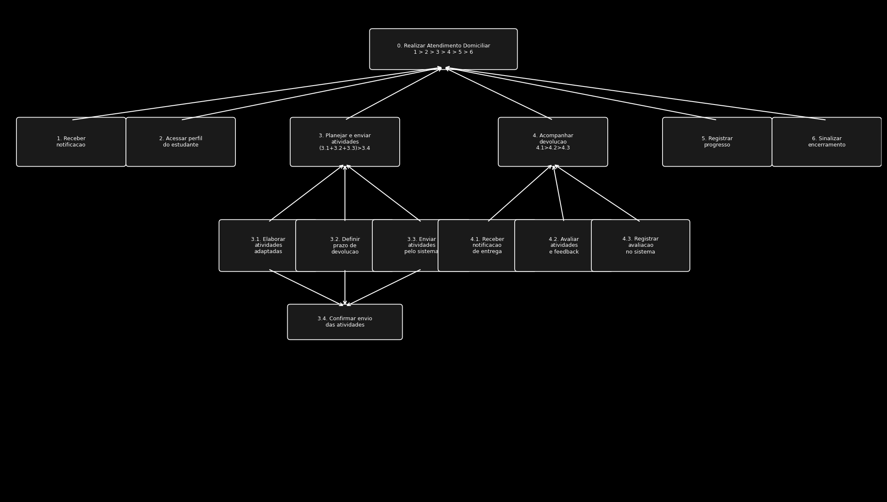
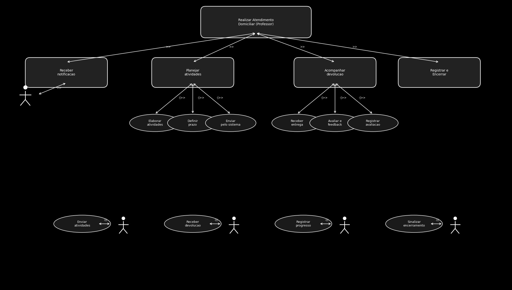

# Análise de Tarefas — Atendimento Domiciliar (Professor)

Para a análise de tarefas ligada à funcionalidade de **Atendimento Domiciliar** sob a perspectiva do professor responsável pelo acompanhamento pedagógico, foram escolhidas a Análise Hierárquica de Tarefas (HTA) e a Árvore de Tarefas Concorrentes (CTT).

---

## Análise Hierárquica de Tarefas (HTA)

A HTA decompõe o objetivo principal do professor — realizar o atendimento domiciliar de um estudante afastado — em subtarefas organizadas hierarquicamente, evidenciando a sequência e as dependências entre as etapas do processo.

Figura 1: HTA — Realizar Atendimento Domiciliar (Professor)

### Decomposição das Tarefas

**0. Realizar Atendimento Domiciliar** `1 > 2 > 3 > 4 > 5 > 6`

- **1. Receber notificação de atendimento domiciliar**
  - Ser notificado pelo sistema quando o pedido de um aluno for deferido

- **2. Acessar perfil do estudante**
  - Visualizar dados do aluno, período de afastamento e orientações relevantes

- **3. Planejar e enviar atividades** `(3.1 + 3.2 + 3.3) > 3.4`
  - 3.1. Elaborar atividades pedagógicas adaptadas
  - 3.2. Definir prazo de devolução
  - 3.3. Enviar atividades pelo sistema
  - 3.4. Confirmar envio das atividades

- **4. Acompanhar devolução** `4.1 > 4.2 > 4.3`
  - 4.1. Receber notificação de entrega pelo responsável
  - 4.2. Avaliar atividades e registrar feedback
  - 4.3. Registrar avaliação no sistema

- **5. Registrar progresso**
  - Documentar formalmente o desenvolvimento do estudante para fins de registro escolar

- **6. Sinalizar encerramento**
  - Indicar no sistema o retorno do estudante às aulas presenciais

### Problemas identificados

- Ausência de sistema integrado obriga o professor a utilizar canais informais (WhatsApp, e-mail pessoal) para comunicação com os responsáveis
- Falta de clareza sobre o formato e os prazos exigidos para registro formal do acompanhamento
- Dificuldade em rastrear o histórico de atividades enviadas e devolvidas sem um sistema centralizado

---

## Árvore de Tarefas Concorrentes (CTT)

A CTT representa as tarefas do professor em termos de concorrência, alternância e habilitação, evidenciando como o professor interage com o sistema e com os responsáveis ao longo do atendimento domiciliar.

Figura 2: CTT — Realizar Atendimento Domiciliar (Professor)

---

## Referências Bibliográficas

**1.** BARBOSA, S. D. J.; SILVA, B. S. da; SILVEIRA, M. S.; GASPARINI, I.; DARIN, T.; BARBOSA, G. D. J. (2021). *Interação Humano-Computador e Experiência do Usuário*. Autopublicação. ISBN: 978-65-00-19677-1.

**2.** Slides Requisitos - aula 10. Milene Serrano e Maurício Serrano. Elicitação, modelagem e análise.

---

## Histórico de Versão

| Versão | Data | Descrição | Autor(es) | Revisor(es) |
|---|---|---|---|---|
| 1.0 | 08/05/2026 | Criação do documento | [Felipe Henrique](https://github.com/fhenrique77) | |
