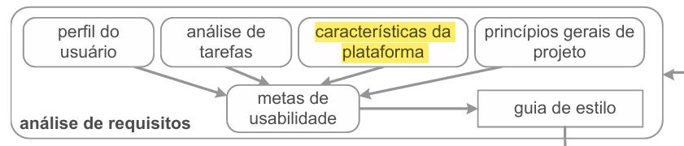

# Características de plataforma para o projeto
## Introdução

As características de plataforma fazem parte da fase de **análise de requisitos** do **ciclo de vida para a engenharia de usabilidade** proposto por ***Mayhew*** em 1999, que busca analisar as possibilidades e limitações da plataforma para auxiliar na produção de metas de usabilidade. Abaixo segue uma figura que representa a 1° fase desse ciclo de vida[[1]](#FONTE1)

Figura 1 - Fase de análise de requisitos do ciclo de vida de *Mayhew*[[1]](#FONTE1)
## Educaçãodf - Carta de Serviços Matrícula
O site **EducaçãoDF — Carta de Serviços Matrícula** é um sistema web utilizado para apresentar informações e serviços relacionados ao processo de matrícula da rede pública de ensino do Distrito Federal principalemente aos responsáveis legais de estudantes e crianças que ainda serão inseridas no ensino público.

### Funcionalidades
A página tem como funcionalidade apenas a distribuição de informações, dessa forma apresenta apenas textos guia e redirecionamentos para diversas ações importantes como:
> - Creches
>
> - Ensino fundamental em tempo integral EFTI
>
> - Ensino médio em tempo integral EMTI
>
> - Matrícula a qualquer tempo
>
> - Novo estudante
>
> - Programa de educação bilíngue intercultural PEBI
>
> - Remanejamento escolar
>
> - Transferencia escolar

### Possibilidades
Entre as possibilidades disponibilizadas pelo site temos:
- Centralização de informações
- Acesso remoto
- Acesso por dispositivos móveis
- Acesso por computadores
- Acessibilidade proporcionada pela funcionalidade de Libras

### Limitações
Apesar dessas possibilidades o site ainda assim apresenta limitações técnicas como:
- Dependência de conexão com a internet
- Utiliza frameworks como *Bootstrap* e *React* que podem atrasar o carregamento da página em conexões mais lentas, além de gerar dependencias

### Problemas
O site *[educacao.df.gov.br/carta-de-servicos-matricula](https://www.educacao.df.gov.br/carta-de-servicos-matricula)* apresenta diversos problemas, entre eles:
- Responsividade incompleta, que deixa a desejar em dispositivos móveis
- Excesso de links de redirecionamentos
- Links que levam a páginas inexistentes ou fora do ar, como para o *Manual de para Atendimento à Educação Infantil – Creche*
- Textos de difícil leitura principalmente em dispositivos móveis
- Sistema constantemente fora do ar 

---
## Fontes

### <a id="FONTE1">1 - Ciclo de vida de usabilidade.</a>
BARBOSA, Simone Diniz Junqueiro; SILVA, Bruno Santana da. Interação Humano-Computador. 1. ed. Rio de Janeiro: Elsevier: Campus, 2010 Página 120, Capítulo 6, Tópico 6.3.3

---

## Referências Bibliográficas

> <a id="REF1">1.</a> BARBOSA, S. D. J.; SILVA, B. S. da; SILVEIRA, M. S.; GASPARINI, I.; DARIN, T.; BARBOSA, G. D. J. (2021). *Interação Humano-Computador e Experiência do Usuário*. Autopublicação. ISBN: 978-65-00-19677-1.

## Histórico de versão

| Versão | Data       | Descrição | Autor(es)| Revisor(es) |
| ------ | ---------- | ---------------------------------------- | ----------------------------------------------------------------------------------------------- | ----------- |
| `1.0`  | 14/05/2026 | Criação da página                        | [Matheus](https://github.com/matheus-06)||