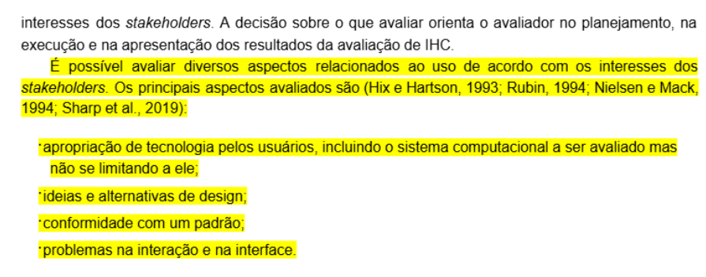
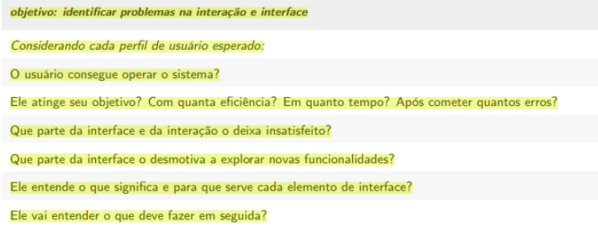
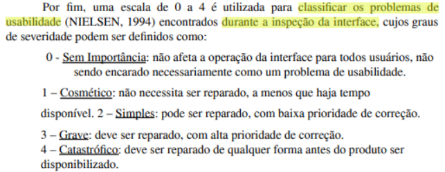
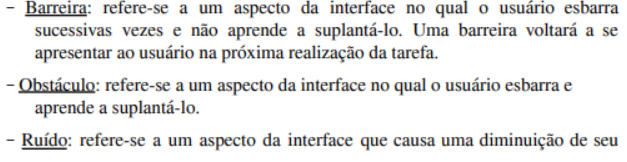

# Planejamento da Avaliação da Análise de Tarefas

### Sistema Avaliado
O site da Secretaria de Estado de Educação do Distrito Federal, especificamente a página de Carta de Serviços – Matrícula, foi selecionado como objeto principal da avaliação.

---

## 1. Contextualização

### Motivações da Escolha

A escolha do site foi motivada pela necessidade de avaliar a clareza e acessibilidade das informações disponibilizadas ao cidadão em um processo crítico, como a matrícula escolar.

Além disso, páginas desse tipo frequentemente apresentam linguagem institucional e grande volume de informações, fatores que podem impactar diretamente a experiência do usuário.

A escolha do site também está alinhada ao planejamento definido no [Processo de Design do projeto](../planejamento/processo-design.md), estruturado a partir do framework DECIDE e do ciclo de vida para Engenharia de Usabilidade de Mayhew[[1]](#FONTE1), garantindo coerência entre os objetivos da avaliação e o sistema analisado.

---

## 2. Framework DECIDE

O planejamento da avaliação foi estruturado com base nas seis etapas do framework DECIDE seguindo o livro Interação Humano-Computador 1° edição de Simone Barbosa[[2]](#FONTE2).

---

## D -  Determinar os Objetivos[[3]](#FONTE3)

O principal objetivo da avaliação é identificar problemas de interação e na interface presentes no portal Educação DF.

Os objetivos específicos incluem:

- Avaliar a clareza das informações disponibilizadas;
- Identificar dificuldades de navegação;
- Verificar problemas de compreensão das funcionalidades;
- Analisar barreiras durante a execução das tarefas;
- Avaliar a experiência dos usuários durante o acesso aos serviços.

As funcionalidades avaliadas serão:

- Transferência Escolar;
- Matrícula PEBI;
- Ensino Especial;
- Creche;
- Painel Educacional;
- Atendimento Domiciliar;
- Atendimento Domiciliar (Professor).

---

## E - Explorar Perguntas Específicas[[4]](#FONTE4)

As perguntas que guiarão a avaliação incluem:

- O usuário consegue operar o sistema?
- O usuário consegue atingir seu objetivo? com qual eficiencia, em quanto tempo e quantos erros?
- Quais partes da interface o deixa insatisfeito?
- O usuário consegue compreender as informações apresentadas?
- Em quais etapas ocorrem erros com maior frequência?
- Existem ambiguidades nas instruções?
- O usuário encontra facilmente os serviços desejados?

---

## C - Escolher os Métodos de Avaliação

Cada funcionalidade utilizará um método de avaliação específico.

| Funcionalidade | Método | Modalidade | Participantes |
|---|---|---|---|
| Transferência Escolar | Entrevista com usuário | Presencial | 2 |
| Matrícula PEBI | Questionário Remoto | Remoto | > 10 |
| Ensino Especial | Entrevista com usuário | Presencial | 2 |
| Creche |Entrevista com usuario | Presencial| 2 |
| Painel Educacional | [A DEFINIR] | [A DEFINIR] | [A DEFINIR] |
| Atendimento Domiciliar | Questionário Remoto | Remoto | > 5 |
| Atendimento Domiciliar (Professor) | Entrevista com o professor | Presencial | 2 |

Os métodos previstos incluem:

### Métodos de Inspeção

- 

### Métodos de Observação

- Questionário Online;
- Avaliação com protótipo em papel.

---

## I - Identificar Questões Práticas
### Perfil dos Participantes

Os participantes deverão representar o público-alvo do sistema em cada funcionalidade, como:

- Pais e responsáveis;

### Equipamentos Utilizados

Os equipamentos previstos para a avaliação incluem:

- Celular;
- Notebook.

### Duração da Avaliação

Tempo estimado:
- Questionário matrícula PEBI (Online): aproximadamente 4 minutos por participante.
- Entrevista com usuário: aproximadamente 10 minutos por participante.

### Recursos Necessários
- Questionário Online:
  - Internet;
  - Plataforma de formulário remoto;
  - Computadores e dispositivos móveis.
- Entrevista com usuário:
  - Computadores e dispositivos móveis.
  - Acesso à internet;

### Equipe Responsável

- Questionário Online: Matheus Pinheiro
- Entrevista com Usuário (Transferência Escolar): Ígor Veras

---

## D - Decidir sobre Questões Éticas

A avaliação seguirá princípios éticos baseados em referências da área de Interação Humano-Computador.

Os princípios considerados incluem:

- autonomia;
- beneficência;
- não maleficência;
- justiça e equidade.

### Termo de Consentimento Livre e Esclarecido (TCLE)

Todos os participantes deverão concordar com o Termo de Consentimento Livre e Esclarecido antes da realização das atividades.

O termo informa que:

- a participação é voluntária;
- a atividade pode ser interrompida a qualquer momento;
- os dados serão utilizados exclusivamente para fins acadêmicos;
- as gravações poderão ser utilizadas nos resultados do projeto;
- o anonimato e a confidencialidade serão preservados.

Caso o participante seja menor de idade, será necessária autorização do responsável legal.

nosso TCL pode ser encontrado na página [Aspectos Éticos](aspectos-eticos.md)

---

## E - Avaliar, Interpretar e Relatar os Dados
Após a coleta dos dados, os resultados serão analisados para identificar padrões de problemas de interação e na interface.

Os problemas encontrados serão classificados por severidade em[[5]](#FONTE5):

- 1: Sem importância
- 2: Cosmético
- 3: Grave
- 4: Catastrófico

e por natureza em[[6]](#FONTE6):
- Barreira
- Obstáculo
- Ruído

O relatório final deverá conter:

- objetivos da avaliação;
- métodos utilizados;
- perfil dos participantes;
- descrição das tarefas;
- problemas encontrados;
- gravidade dos problemas;
- recomendações de melhoria;
- resultados consolidados.

Mais informações podem ser encontradas em [Planejamento da Avaliação do relato dos resultados da avaliação da análise de tarefas](planejamento-relato-resultados-analise-tarefas.md)

---

## 3. Teste Piloto

Antes da avaliação oficial será realizado um teste piloto.

## Resultado do Teste Piloto

Abaixo seguem os vídeos feitos do teste piloto de cada analise de tarefa elaborada, cada integrante ficou responsável por realizar o teste piloto das funcionaldiades que avaliaram.

<a href="https://www.youtube.com/embed/ZPUZOT0u2kU" target="blanket">Transferência Escolar</a>

<iframe width="1863" height="754" src="https://www.youtube.com/embed/ZPUZOT0u2kU" title="Teste piloto verificação análise de tarefas transferência escolar" frameborder="0" allow="accelerometer; autoplay; clipboard-write; encrypted-media; gyroscope; picture-in-picture; web-share" referrerpolicy="strict-origin-when-cross-origin" allowfullscreen></iframe>

Autor: [Ígor Veras](https://github.com/igorvdaniel).

<a href="https://www.youtube.com/embed/eaL0rDLUx7w" target="blanket">Matrícula PEBI</a>

<iframe width="1863" height="754" src="https://www.youtube.com/embed/eaL0rDLUx7w" title="Teste piloto verificação análise de tarefas Matrícula PEBI" frameborder="0" allow="accelerometer; autoplay; clipboard-write; encrypted-media; gyroscope; picture-in-picture; web-share" referrerpolicy="strict-origin-when-cross-origin" allowfullscreen></iframe>

Autor: [Matheus Pinheiro](https://github.com/matheus-06).

<a href="https://www.youtube.com/watch?v=bBaG3CEX8Uo" target="blanket">Serviço especial</a>

<iframe width="1863" height="754" src="https://www.youtube.com/embed/bBaG3CEX8Uo" title="Teste piloto verificação análise de Serviço especial" frameborder="0" allow="accelerometer; autoplay; clipboard-write; encrypted-media; gyroscope; picture-in-picture; web-share" referrerpolicy="strict-origin-when-cross-origin" allowfullscreen></iframe>

Autor: [Luara Cristiana](https://github.com/luacristiana).

<a href="https://www.youtube.com/embed/TBPbU4wRkdI" target="blanket">Serviço especial</a>

<iframe width="465" height="827" src="https://www.youtube.com/embed/TBPbU4wRkdI" title="19 de maio de 2026" frameborder="0" allow="accelerometer; autoplay; clipboard-write; encrypted-media; gyroscope; picture-in-picture; web-share" referrerpolicy="strict-origin-when-cross-origin" allowfullscreen></iframe>

Autor: [Giulia Paulucci](https://github.com/GiuliaPaulucci).

### Objetivos do Piloto

- Verificar a clareza das instruções;
- Validar os instrumentos de coleta;
- Avaliar o tempo necessário;
- Identificar possíveis problemas metodológicos.

### Data do Teste Piloto

19/05/2026

### Participantes do Piloto

- Felipe Henrique Oliveira Sousa	
- Giulia Paulucci da Hora Viana	
- Igor Veras Daniel	
- João Guilherme Santana de Oliveira	
- Luara Cristiana da Costa e Silva	
- Matheus Pinheiro

### Observação

Os resultados do teste piloto não serão incorporados aos resultados finais da avaliação oficial.

---

---

## Referências Bibliográficas

## 
1 - Fontes Processo de Mayhew.
 

Fonte: BARBOSA, Simone Diniz Junqueiro; SILVA, Bruno Santana da. Interação Humano-Computador. 1. ed. Rio de Janeiro: Elsevier: Campus, 2010 Página: 120,Capítulo 6

## 
2 - Livro: BARBOSA, Simone Diniz Junqueiro; SILVA, Bruno Santana da. Interação Humano-Computador. 1. ed. Rio de Janeiro: Elsevier: Campus, 2010.
 

## 
3 - Aspectos de avaliação.
 

Fonte: BARBOSA, Simone Diniz Junqueiro; SILVA, Bruno Santana da. Interação Humano-Computador. 1. ed. Rio de Janeiro: Elsevier: Campus, 2010 Página: 264,Capítulo 11

## 
4 - Perguntas de interação e interface.
 

Fonte: BARBOSA, Simone Diniz Junqueiro; SILVA, Bruno Santana da. Interação Humano-Computador. 1. ed. Rio de Janeiro: Elsevier: Campus, 2010 Página: 266,Capítulo 11

## 
5 - Severidade do problema.
 

Fonte: MACIEL, Cristiano; NOGUEIRA, José Luis T.; CIUFFO, Leandro Neumann; GARCIA, Ana Cristina Bicharra. Avaliação Heurística de Sítios na Web. Niterói: Instituto de Computação – UFF, 2004. Página 4, Tópico 2

## 
6 - Natureza do problema.
 

Fonte: MACIEL, Cristiano; NOGUEIRA, José Luis T.; CIUFFO, Leandro Neumann; GARCIA, Ana Cristina Bicharra. Avaliação Heurística de Sítios na Web. Niterói: Instituto de Computação – UFF, 2004. Página 3, Tópico 2

---

---

## Histórico de versão

| Versão | Data       | Descrição | Autor(es)| Revisor(es) |
| ------ | ---------- | ---------------------------------------- | ----------------------------------------------------------------------------------------------- | ----------- |
| `1.0`  | 19/05/2026 | Criação da página                        | [Matheus](https://github.com/matheus-06)||
| `1.1`  | 19/05/2026 | Adição do vídeo de teste piloto          | [Matheus](https://github.com/matheus-06)||
| `1.2`  | 19/05/2026 | Adição do vídeo de teste piloto - Serviço especial| [Luara Cristiana](https://github.com/luacristiana)||
| `1.3`  | 19/05/2026 | Adição das referências linkadas          | [Matheus](https://github.com/matheus-06)||
